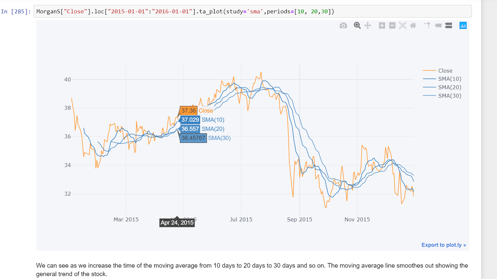
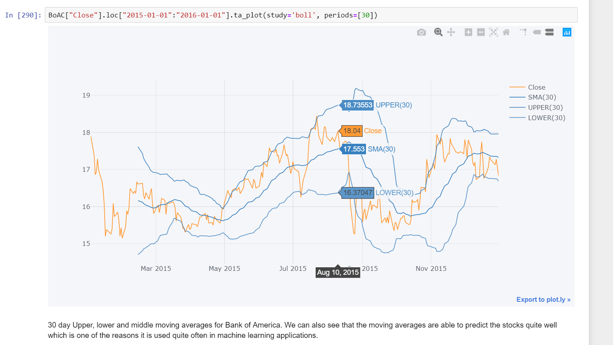

# Bank-Stock-Analysis
Conducted exploratory data analysis of stock prices to better understand financial crisis of 2007–2008 and their effect on US-Banks. I analyzed Bank of America, CitiGroup, Goldman Sachs, JPMorgan Chase, Morgan Stanley and Wells Fargo stocks.

Note: The cufflinks iplots don't show up on github ipynb files, so I have linked the images below:

